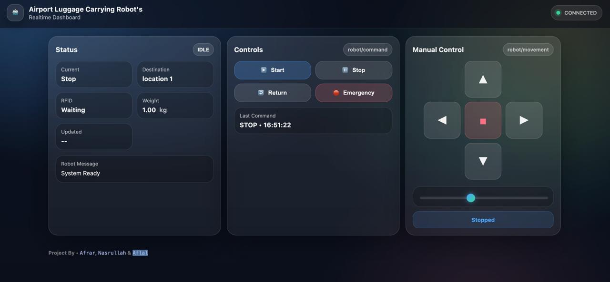
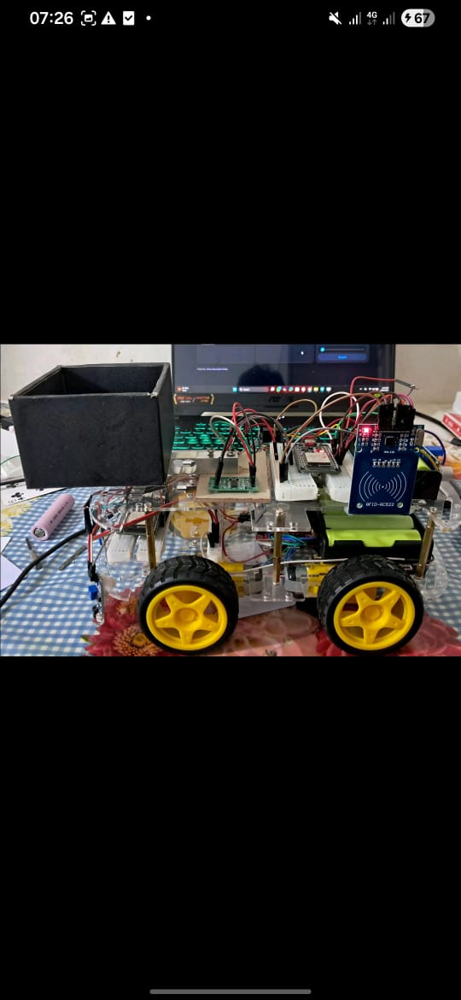
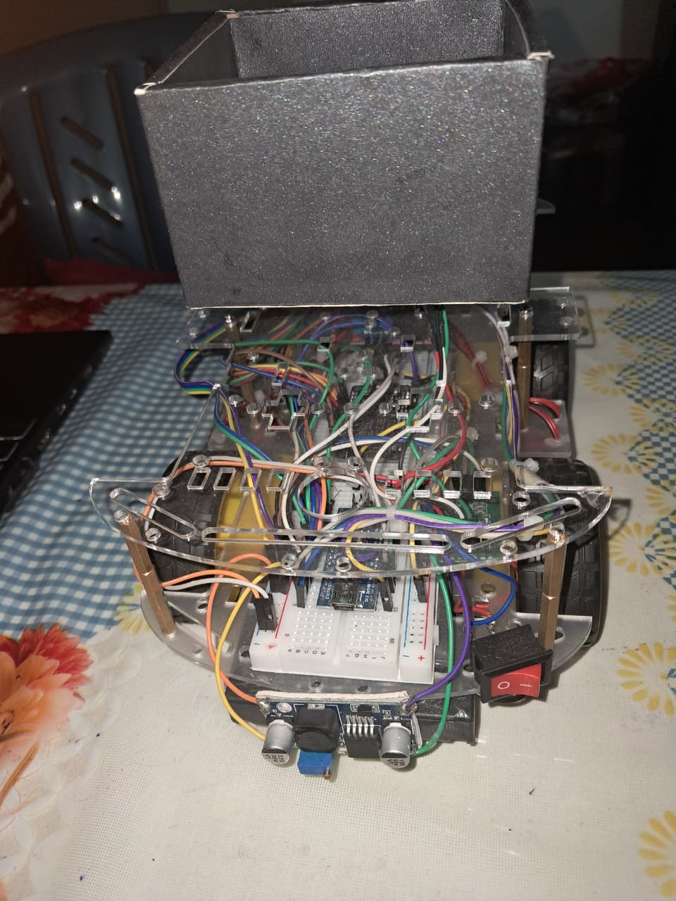
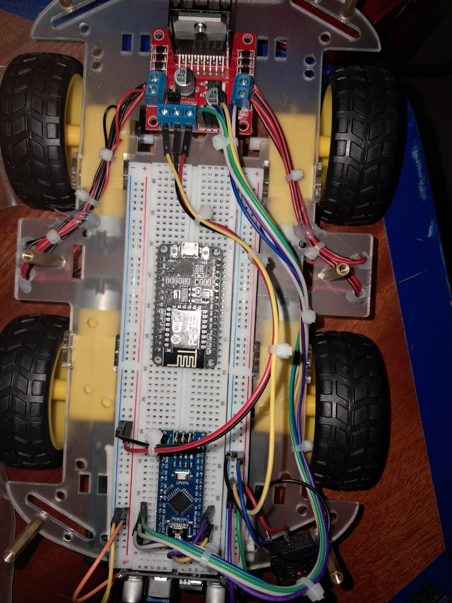
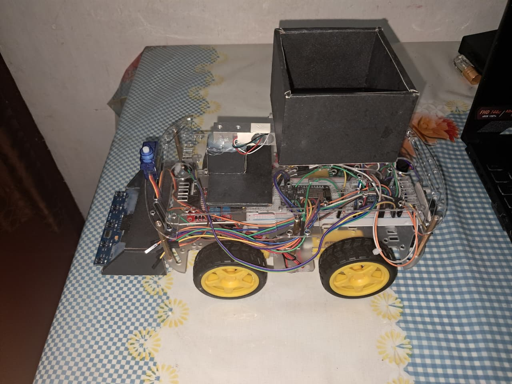

<div align="center">


<br/><br/>

# 🤖 Airport Luggage Carrying & Location Finding Robot

### *Autonomous Line-Following Robot for Smart Airport Navigation*

> An embedded robotic system that carries passenger luggage, measures weight, reads RFID destination cards, and navigates autonomously through predefined airport routes — returning home when the job is done.

<br/>


> 📸 *Real prototype built and tested — see [Photos](#-robot-photos) section below*

</div>

---

## 📋 Table of Contents

- [Overview](#-overview)
- [Features](#-features)
- [System Workflow](#-system-workflow)
- [Hardware Components](#-hardware-components)
- [Realtime Web Dashboard](#-realtime-web-dashboard)
- [Circuit Design](#-circuit-design)
- [How It Works](#-how-it-works)
- [Project Structure](#-project-structure)
- [Robot Photos](#-robot-photos)
- [Design & Planning](#-design--planning)
- [Limitations & Future Work](#-limitations--future-work)
- [Team](#-team)

---

## 🌐 Overview

Modern airports can be overwhelming — long distances, heavy luggage, confusing layouts. This project proposes a **low-cost autonomous robot** designed to ease passenger burden by:

- ✅ **Carrying small luggage** between checkpoints
- ✅ **Verifying weight** before accepting any load (max 1 kg)
- ✅ **Letting passengers choose a destination** by scanning an RFID card
- ✅ **Navigating autonomously** along a predefined floor track
- ✅ **Returning to base** automatically after delivery

Built on affordable microcontrollers and sensors, the robot demonstrates how IoT and embedded systems can be applied to real-world logistics challenges.

---

## ✨ Features

| Feature | Details |
|---|---|
| 🏋️ Weight Measurement | Load Cell (1 kg) + HX711 Amplifier — auto-rejects overload |
| 🪪 RFID Navigation | RC522 module — maps cards to 4 destination locations |
| 🛣️ Line Following | 5-channel IR sensor array — handles T-junctions accurately |
| 📟 User Feedback | 16x2 LCD display + buzzer + LED indicators |
| 🔋 Power System | 18650 Li-ion batteries + BMS + dual DC-DC Buck converters |
| 🔁 Auto-Return | Robot returns to start once luggage is collected (load = 0) |

> **⚠️ Note:** Ultrasonic obstacle avoidance, buzzer, LCD, and LEDs are planned features — partially implemented in the current prototype version.

---

## 🔄 System Workflow

```
┌─────────────────────────────────────────────────────────┐
│                    SYSTEM START                         │
│           Initialize MCU, Sensors, LCD                  │
└──────────────────────┬──────────────────────────────────┘
                       │
                       ▼
          ┌────────────────────────┐
          │  Passenger Places      │
          │  Luggage on Platform   │
          └────────────┬───────────┘
                       │
                       ▼
          ┌────────────────────────┐     ┌──────────────────────┐
          │  Weight ≤ 1 kg ?       │─ NO─►  Buzzer + Red LED    │
          └────────────┬───────────┘     │  LCD: "Exceeds 1kg"  │
                    YES│                 │  → Restart           │
                       ▼                 └──────────────────────┘
          ┌────────────────────────┐
          │  Scan RFID Card        │
          │  (Location 01–04)      │
          └────────────┬───────────┘
                       │
                       ▼
          ┌────────────────────────┐
          │  Follow Line to        │
          │  Selected Destination  │
          └────────────┬───────────┘
                       │
                       ▼
          ┌────────────────────────┐
          │  Arrived! Wait for     │
          │  Passenger to Collect  │
          └────────────┬───────────┘
                       │
                       ▼
          ┌────────────────────────┐
          │  Load = 0 kg ?         │
          │  → Auto Return to Base │
          └────────────────────────┘
```

---

## 🔩 Hardware Components

| Component | Model | Purpose |
|---|---|---|
| Microcontroller | Arduino Nano | Motor control, sensor reading, logic |
| WiFi Module | NodeMCU ESP8266 | RFID processing & communication |
| Motor Driver | L298N | Controls 4x DC motors |
| Line Sensor | 5-Channel IR Array | Line following + T-junction detection |
| RFID Module | RC522 | Destination card scanning |
| Weight Sensor | Load Cell 1kg + HX711 | Luggage weight measurement |
| Display | 16x2 LCD (I²C) | Status messages to user |
| Power | 18650 Li-ion × 2 + BMS | Main power supply |
| Regulation | DC-DC Buck Converter ×2 | 6V (motors) + 5V (logic) |
| Chassis | 4-Wheel Acrylic Platform | Structural base |

---

## 🖥️ Realtime Web Dashboard

The robot is paired with a **live web-based control dashboard** that communicates wirelessly via the NodeMCU ESP8266.



### Dashboard Features

| Panel | Functionality |
|---|---|
| 📊 **Status** | Live display of robot state (IDLE / RUNNING), current stop, destination, RFID status, weight, and robot messages |
| 🎮 **Controls** | One-click buttons — `Start`, `Stop`, `Return to Base`, `Emergency Stop` |
| 🕹️ **Manual Control** | Directional pad (Forward / Back / Left / Right / Stop) for manual override |
| 🎚️ **Speed Control** | Real-time speed slider to adjust motor speed remotely |
| 🟢 **Connection Status** | Live MQTT/WebSocket connection indicator (`CONNECTED` / `DISCONNECTED`) |

### MQTT Topics

| Topic | Purpose |
|---|---|
| `robot/command` | Send commands (start, stop, return, emergency) |
| `robot/movement` | Send directional movement instructions |
| `robot/status` | Receive live robot state updates |

> The dashboard is served via the **NodeMCU ESP8266** onboard web server and communicates over **MQTT** — no internet required, works on local WiFi.

---

## ⚡ Circuit Design

The full circuit was designed in **Cirkit Designer**, integrating all modules across a dual-layer chassis:

**Layer 1 (Bottom)** — Motors, motor driver, IR sensor panel, battery, buck converters, breadboard

**Layer 2 (Top)** — Arduino Nano, NodeMCU, RFID scanner, LCD display, load cell, buzzer, LEDs, switch

> See `circuit_image.png` in this repository for the full wiring diagram.

---

## ⚙️ How It Works

**1. Startup**
The system powers on, initializes the LCD, and displays `"Ready. Place your luggage."`

**2. Weight Check**
The load cell measures the placed luggage. If it exceeds 1 kg, the buzzer sounds and a red LED turns on, prompting the passenger to remove excess weight.

**3. RFID Scan**
The passenger taps an RFID card. Each card is pre-mapped to one of 4 destinations:
- 📍 Location 01 — Gate / Check-in
- 📍 Location 02 — Baggage Claim
- 📍 Location 03 — Departure Hall
- 📍 Location 04 — Arrivals

**4. Navigation**
The robot follows the black-tape track using 5 IR sensors. At T-junctions, it selects the correct turn based on the RFID-decoded destination.

**5. Delivery & Return**
On arrival, the LCD shows `"Arrived. Please take your luggage."` Once the load cell reads 0 kg, the robot automatically navigates back to the starting point.

---

## 📁 Project Structure

```
airport-luggage-robot/
│
├── 📄 README.md                  # This file
├── 📄 Proposal.pdf               # Full project proposal document
├── 📄 Robot_Flowchart.pdf        # System flowchart
├── 🖼️  circuit_image.png          # Cirkit Designer wiring diagram
│
├── 📂 src/
│   ├── arduino_nano_main.ino     # Motor control + IR line following
│   └── nodemcu_rfid.ino          # RFID scanning + destination mapping
│
└── 📂 docs/
    └── design_sketches/          # Hand-drawn chassis layouts (3D views)
```

---

## 📸 Robot Photos

<table>
  <tr>
    <td align="center"><b>Full Robot — Side View</b></td>
    <td align="center"><b>Full Robot — Isometric View</b></td>
  </tr>
  <tr>
    <td></td>
    <td></td>
  </tr>
  <tr>
    <td align="center"><b>Electronics — Top View</b></td>
    <td align="center"><b>Interior Wiring</b></td>
  </tr>
  <tr>
    <td></td>
    <td></td>
  </tr>
</table>

---

## 📐 Design & Planning

The robot uses a **two-layer chassis** design:

- **Layer 1**: Houses the 4-wheel drive system, motor driver, battery, buck converters, IR sensor panel
- **Layer 2**: Mounts the user-facing components — LCD, RFID scanner, LEDs, buzzer, Arduino Nano, NodeMCU, and the luggage platform (with integrated load cell)

Full 3D hand-drawn schematics (top view, side view, front view) are included in the `docs/` folder and the project proposal.

### Pin Mapping — Arduino Nano

| Pin | Component |
|---|---|
| D2–D6 | IR Sensor Array (5 channels) |
| D7, D8 | Load Cell (HX711 DT, SCK) |
| D8, D9 | Ultrasonic Sensor (Trig, Echo) |
| A4, A5 | LCD Display (SDA, SCL) |
| SPI Pins | RFID RC522 (via NodeMCU) |

---

## 🚧 Limitations & Future Work

**Current Limitations**
- Track-dependent: requires black tape on white surface
- Maximum 1 kg payload (prototype constraint)
- No dynamic obstacle avoidance in current build

**Planned Improvements**
- 🔭 Ultrasonic obstacle detection & auto-rerouting
- 📱 QR code or NFC-based payment & check-in
- 🗺️ GPS-based free navigation (replacing fixed tracks)
- 💪 Higher payload with upgraded motor system
- 🤖 ML-based adaptive pathfinding

---

## 👥 Team

**Group 9 — IoT & Robotics | HND in Computing & Systems Analysis**

| Name | Student ID |
|---|---|
| R.M. Aflal | KIC-HNDCSAI-252F-008 |
| M.H. Nasrullah | KIC-HNDCSAI-252F-031 |
| M.F.M. Afrar | KIC-HNDCSAI-252F-043 |

---

<div align="center">

*Built with ❤️ using Arduino, ESP8266, and a lot of wires*

⭐ **Star this repo if you found it interesting!**

</div>
